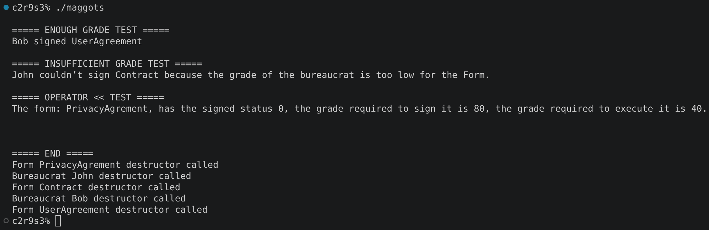
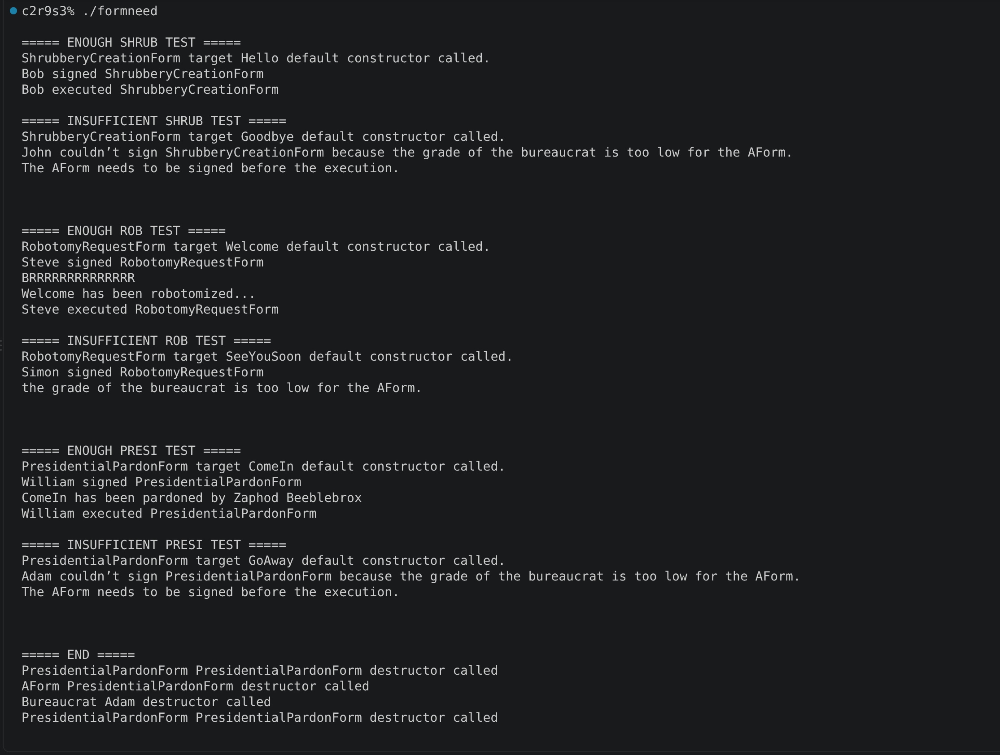
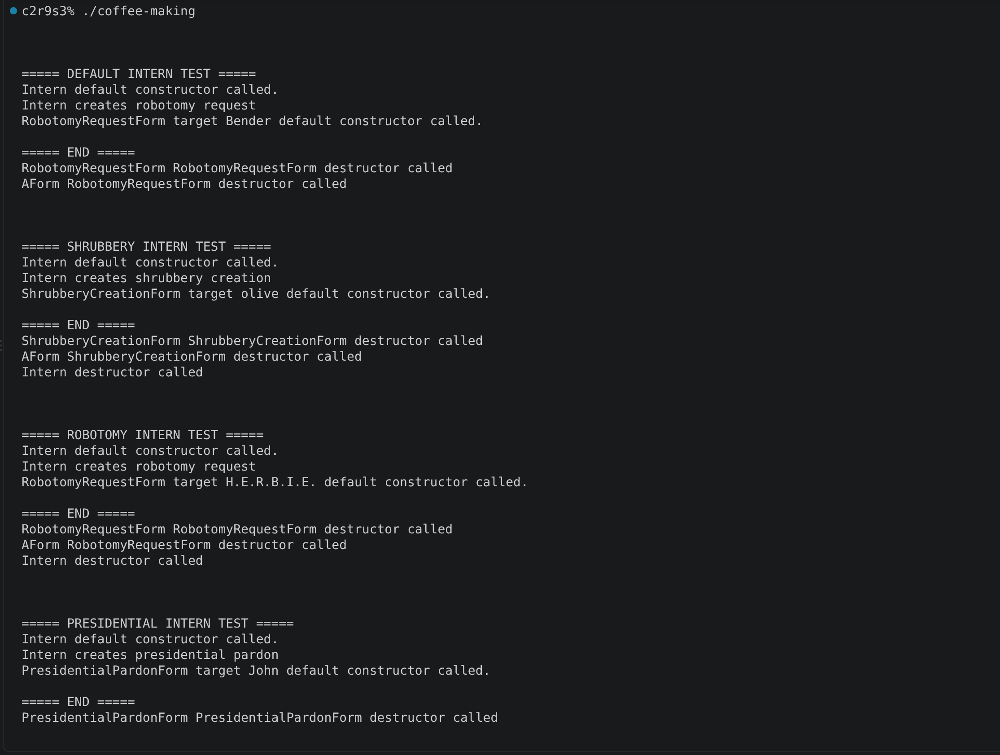

# cpp_module_05

### Clarifications and general tips:

* If you find any kind of error or have suggestions to improve, please do not hesitate to point them out in the `issues` section! Obviously always respectfully, thank you :D.
* All the executable files that this project creates have been selected by me. For your own project, you can use whatever names you prefer to create your files, always keeping the subject in mind.
* Always remember that the output examples are just examples. They can vary in your own project and still be fine.

## ex00: Mommy, when I grow up, I want to be a bureaucrat!

### Mandatory requirements:

* A `Bureaucrat` class is created with:
  * A constant `name`.
  * A `grade` (WARNING: Pay attention to the ranges, they can cause confussions).
    * The grade is always between:
        * **1** → as the *highest* possible grade.
        * **150** → as the *lowest* possible grade.
        * If an invalid grade is introduced, the constructor must throw:
            * `Bureaucrat::GradeTooHighException` if the grade is below `1`.
            * `Bureaucrat::GradeTooLowException` if the grade is above `150`.
* For both attributes is implemented:
  * `getName()`
  * `getGrade()`
* Two member functions are implemented to increment or decrement the bureaucrat's grade (The subject doesn't give names for the functions, so you are free to choose your own):
* An overload of the insertion (<<) operator is implemented to print the output in an expecific format: `<name>, bureaucrat grade <grade>`.
* IMPORTANT: Increasing the bureaucrat's grade means making the numerical grade **smaller**.

### What can we learn about this exercise?:

This exercise introduces **exception handling in C++**, the main concepts are: `throw`, `try`, `catch`, and inheritance from `std::exception`.
The important idea is that instead of returning an error value when an invalid grade is detected, the class can **throw an exception**, transferring control to a corresponding `catch` block.
It is also important (again), to understand the slightly unusual grade system used by the project: **a smaller number means a higher bureaucratic rank**.

### Output example:

## ex01: Form up, maggots!

### Mandatory requirements:

* All the files from the previous exercise are copied here.
* A `Form` class is added with:
    * A *constant* `name`.
    * A *boolean* indicating whether the form is signed (at construction, it shouldn't be).
    * A *constant* grade required to *sign* the form.
    * A *constant* grade required to *execute* the form.
* All attributes are *private*.
* The form starts always as *unsigned*.
* The grades follow the same rules as the previous exercise (the higher and the lower grade):
* Invalid grades throw (yes, same name as the previous exercise, but with the class Form):
  * `Form::GradeTooHighException`
  * `Form::GradeTooLowException`
* Getters are implemented for each one of the new attributes.
* The insertion operator is overloaded (`<<`) to display *all the form's information*.

### What can we learn about this exercise?:

This exercise builds on the exception system from `ex00` and introduces **interaction between classes through exceptions**. We will also learn to manage an strict validation between classes.

### Output example:

## ex02: No, you need form 28B, not 28C...

### Mandatory requirements:

* All the files from the previous exercise are copied here.
* `Form` is renamed to `AForm` and turned it into an **abstract class**.
* The form attributes are keeped *private*.
* The following concrete form classes are created, and have the following characteristics:
    * `ShrubberyCreationForm`
        * sign grade should be *145*
        * execute grade should be *137*
        * When executed, it must create a file named `<target>_shrubbery` in the current working directory and write several ASCII trees into the file (you are free to choose the type of tree you prefer).
    * `RobotomyRequestForm`
        * sign grade should be *72*
        * execute grade should be *45*
        * When executed, it must:
            * Make drilling noises.
            * Display a message announcing that the robotomy has been sucessful or has failed (the chances that first or second message is displayed are 50% each one).
    * `PresidentialPardonForm`
        * sign grade should be *25*
        * execute grade should be *5*
        * When executed, it only must inform that the target has been pardoned by: `Zaphod Beeblebrox`
    * Each concrete form receives only one constructor parameter, it is the target of the form:
* The function `void execute(Bureaucrat const &executor) const` is added to `AForm`. This function is used on the other forms to execute on each one its concrete actions, but before one Form is executed, it is checked that the form *has been signed*, and the bureaucrat has a *sufficiently high grade*. If either requirement is not satisfied, an appropriate exception is thrown. The specific action of each form is inside them, not in the base class.
* The function `void executeForm(AForm const &form) const` is added to `Bureaucrat`, and tries to execute the form, if its successful it prints: `<bureaucrat> executed <form>`, if not it prints the proper exception.

### What can we learn about this exercise?:

This is the exercise where several previous concepts come together, above all **Abstract classes** and **Pure virtual functions**. The main challenge is the inheritance of each forms, maintaining its concrete actions and validations aligned with the requirments of the subject. Keeping in mind always the exceptions cases.

### Output example:

## ex03: At least this beats coffee-making

### Mandatory requirements:

* All the files from the previous exercise are copied here.
* An `Intern` class is added.
    * It has no name, no grade and no special characteristics.
    * But it has implemented the function `AForm *makeForm(std::string formName, std::string target)`, it has:
        * Two parameters, the *name* of the form to create and the *target* of the form.
        * A return value which consists of an `AForm` object pointer to the corresponding form *name* passed as parameter.
    * The intern prints `Intern creates <form>`, if the name provided exists, if not it prints an error message.
* In this exercise is important to avoid solutions as if / else if... The best solution is the one that use an *array of pointers to functions* (as we can see in the exercise of this repository).

### What can we learn about this exercise?:

This exercise introduces a simple **factory-like pattern**. Instead of the rest of the program having to know how every form is constructed, that responsibility is centralized inside `Intern`. The exercise also teach us how to use other comparisong methods that aren't switch or if, else if.

### Output example:

#### Last but not least, check out this other repository if you feel lost, it helped me a lot through the project:

https://github.com/tblaase/CPP-Module-05 

https://github.com/Dsite42/CPP05