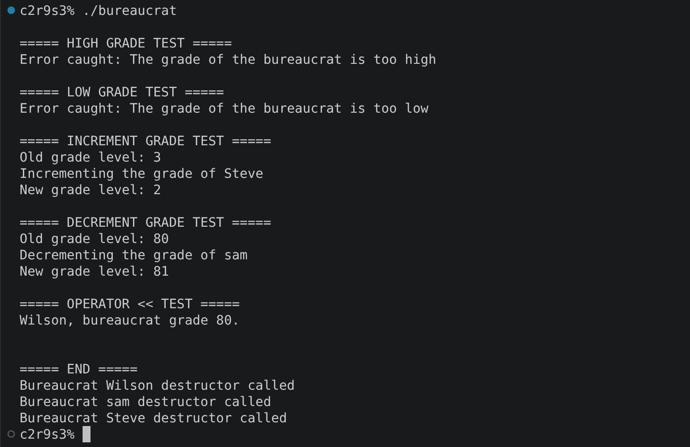

# cpp_module_05

### Clarifications and general tips:

* If you find any kind of error or have suggestions to improve, please do not hesitate to point them out in the `issues` section! Obviously always respectfully, thank you :D.
* All the executable files that this project creates have been selected by me. For your own project, you can use whatever names you prefer to create your files, always keeping the subject in mind.
* Always remember that the output examples are just examples. They can vary in your own project and still be fine.


## ex00: Mommy, when I grow up, I want to be a bureaucrat!

### Mandatory requirements:

* Create a `Bureaucrat` class with:
  * A constant `name`.
  * A `grade` (WARNING: Pay attention to the ranges, they can cause confussions).
    * The grade must always be between:
        * **1** → *highest* possible grade.
        * **150** → *lowest* possible grade.
        * If an invalid grade is introduced, the constructor must throw:
            * `Bureaucrat::GradeTooHighException` if the grade is below `1`.
            * `Bureaucrat::GradeTooLowException` if the grade is above `150`.
* Implement for both attributes:
  * `getName()`
  * `getGrade()`
* Implement two member functions to increment or decrement the bureaucrat's grade (The subject doesn't give names for the functions, so you are free to choose your own):
* Implement an overload of the insertion (<<) operator to print the output in an expecific format: `<name>, bureaucrat grade <grade>`.
* IMPORTANT: Increasing the bureaucrat's grade means making the numerical grade **smaller**.

### What can we learn about this exercise?:

This exercise introduces **exception handling in C++**, the main concepts are: `throw`, `try`, `catch`, and inheritance from `std::exception`.
The important idea is that instead of returning an error value when an invalid grade is detected, the class can **throw an exception**, transferring control to a corresponding `catch` block.
It is also important (again), to understand the slightly unusual grade system used by the project: **a smaller number means a higher bureaucratic rank**.

### Output example:



## ex01: Form up, maggots!

### Mandatory requirements:

* Copy all the files from the previous exercise.
* Create a `Form` class with:
    * A *constant* `name`.
    * A *boolean* indicating whether the form is signed (at construction, it shouldn't be).
    * A *constant* grade required to *sign* the form.
    * A *constant* grade required to *execute* the form.
* All attributes must be *private*.
* The form starts as *unsigned*.
* The grades must follow the same rules as the previous exercise (the higher and the lower grade):
* Invalid grades must throw (yes, same name as the previous exercise, but with the class Form):
  * `Form::GradeTooHighException`
  * `Form::GradeTooLowException`
* Implement getters for each one of the new attributes.
* Overload the insertion operator (`<<`) to display *all the form's information*.

### What can we learn about this exercise?:

This exercise builds on the exception system from `ex00` and introduces **interaction between classes through exceptions**.

The main concepts are:

* Object collaboration.
* Encapsulation.
* Passing objects by reference.
* Exception propagation.
* Comparing permissions/grades.
* Designing classes that report failures through exceptions instead of return values.

A useful way to think about the relationship is:

```text
Bureaucrat
    |
    | tries to sign
    v
  Form
    |
    | checks grade
    v
 success / exception
```

The `Bureaucrat` doesn't directly modify the form's internal state. Instead, the `Form` is responsible for deciding whether it can be signed.

---

## ex02: No, you need form 28B, not 28C...

### Mandatory requirements:

* Start from the previous exercises.
* Rename `Form` to `AForm` because it must now be an **abstract class**.
* Keep the form attributes private.
* Create the following concrete form classes:

### `ShrubberyCreationForm`

Required grades:

```text
Sign:    145
Execute: 137
```

When executed, it must create:

```text
<target>_shrubbery
```

in the current working directory and write ASCII trees into the file.

---

### `RobotomyRequestForm`

Required grades:

```text
Sign:    72
Execute: 45
```

When executed, it must:

* Make drilling noises.
* Successfully robotomize the target **50% of the time**.
* Otherwise report that the robotomy failed.

---

### `PresidentialPardonForm`

Required grades:

```text
Sign:    25
Execute: 5
```

When executed, it must inform that the target has been pardoned by:

```text
Zaphod Beeblebrox
```

---

Each concrete form must receive only one constructor parameter:

```cpp
const std::string &target
```

Add:

```cpp
void execute(Bureaucrat const &executor) const;
```

to `AForm`.

Before executing a form, you must check:

* The form has been signed.
* The bureaucrat has a sufficiently high grade.

If either requirement is not satisfied, an appropriate exception must be thrown.

The actual action should then be implemented by each concrete form.

You can choose whether to perform the checks:

* In the base class before calling the concrete action.
* Inside each concrete form.

The subject notes that one approach is more elegant than the other.

Finally, add to `Bureaucrat`:

```cpp
void executeForm(AForm const &form) const;
```

This function must attempt to execute the form.

If successful:

```text
<bureaucrat> executed <form>
```

Otherwise, print an explicit error message.

### What can we learn about this exercise?:

This is the exercise where several previous concepts come together.

The main concepts are:

* **Abstract classes**.
* **Pure virtual functions**.
* Inheritance.
* Polymorphism.
* Exception handling.
* Class interfaces.
* Separating common validation from concrete behavior.
* Dynamic allocation.
* Resource management.

A useful design is to let `AForm` handle the common requirements:

```text
             AForm
            /     \
           /       \
  Shrubbery       Robotomy
     |               |
     |               |
  concrete        concrete
   action           action
```

The base class knows the common properties and requirements, while every derived class implements its own specific action.

This is also where memory management becomes particularly important. Any dynamically allocated form must eventually be properly destroyed.

---

## ex03: At least this beats coffee-making

### Mandatory requirements:

* Start from the previous exercises.
* Create an `Intern` class.
* The intern:

  * Has no name.
  * Has no grade.
  * Has no special characteristics.
* Implement:

```cpp
AForm *makeForm(std::string formName, std::string target);
```

The function receives:

* The name of the form to create.
* The target of the form.

It must return a pointer to the corresponding `AForm`.

The supported forms are:

```text
shrubbery creation
robotomy request
presidential pardon
```

For example:

```cpp
Intern someRandomIntern;

AForm *rrf;

rrf = someRandomIntern.makeForm(
    "robotomy request",
    "Bender"
);
```

The intern should print something similar to:

```text
Intern creates <form>
```

If the requested form does not exist, the program must print an explicit error message.

### Important requirement:

Avoid implementing the form factory as an unreadable collection of excessive:

```cpp
if
else if
else if
else if
...
```

The subject explicitly states that this type of solution will not be accepted during evaluation.

### What can we learn about this exercise?:

This exercise introduces a simple **factory-like pattern**.

The `Intern` receives information about what object should be created and returns the appropriate derived `AForm`.

Instead of the rest of the program having to know how every form is constructed, that responsibility is centralized inside `Intern`.

Conceptually:

```text
                form name
                    |
                    v
                 Intern
                    |
          +---------+---------+
          |         |         |
          v         v         v
      Shrubbery  Robotomy  Presidential
       Form       Form       Pardon
```

This makes the code easier to extend: adding another form should not require rewriting the whole program around the place where forms are requested.

The exercise also reinforces **dynamic allocation**, since `makeForm()` returns an `AForm*`.

---

## Important concepts from Module 05

### Exceptions

The three fundamental keywords are:

```cpp
try
throw
catch
```

A simplified example:

```cpp
try
{
    // Code that may fail
    bureaucrat.incrementGrade();
}
catch (std::exception &e)
{
    std::cout << e.what() << std::endl;
}
```

`throw` transfers control to a matching exception handler. The exception can propagate up the call stack until a suitable `catch` is found.

---

### Custom exception classes

The project frequently uses nested exception classes:

```cpp
class GradeTooHighException : public std::exception
{
public:
    virtual const char *what() const throw();
};
```

This allows the class to communicate exactly what went wrong.

For example:

```cpp
throw Bureaucrat::GradeTooHighException();
```

And later:

```cpp
catch (std::exception &e)
{
    std::cout << e.what() << std::endl;
}
```

The subject specifically expects these exceptions to work with standard `try` / `catch` handling.

---

### Orthodox Canonical Form

From Module 02 onward, classes are generally expected to follow the **Orthodox Canonical Form**, except where the subject explicitly says otherwise.

That means implementing:

```text
Default constructor
Copy constructor
Copy assignment operator
Destructor
```

Exception classes do **not** need to follow OCF in this module.

---

### Grade system

This is probably the easiest thing to get wrong during the project:

```text
1   = highest
150 = lowest
```

Therefore:

```text
incrementGrade()
```

means:

```text
10 -> 9
```

while:

```text
decrementGrade()
```

means:

```text
10 -> 11
```

Do not interpret "increment" as increasing the numerical value.

---

## Testing checklist

Before considering the module finished, make sure you test at least:

### `ex00`

* Valid bureaucrat.
* Grade `1`.
* Grade `150`.
* Grade `0`.
* Grade `151`.
* Increment from grade `1`.
* Decrement from grade `150`.
* Copy constructor.
* Assignment operator.
* Output operator.

### `ex01`

* Valid form.
* Form with grade `1`.
* Form with grade `150`.
* Invalid form grades.
* Bureaucrat with enough grade signing a form.
* Bureaucrat without enough grade.
* Already signed form.
* Different combinations of bureaucrat/form grades.

### `ex02`

* Unsigned form execution.
* Signed form with insufficient executor grade.
* Signed form with sufficient executor grade.
* Every concrete form.
* `ShrubberyCreationForm` file creation.
* Successful and failed robotomy.
* Presidential pardon.
* Correct polymorphic behavior.
* Memory leaks.

### `ex03`

* Creation of every supported form.
* Correct target propagation.
* Unknown form name.
* Memory management of the returned `AForm*`.
* Verify that the factory does not rely on an excessive `if/else` chain.

---

### What can we learn about this module?

Module 05 is essentially the transition from simply checking whether something is valid to designing a program where **errors are part of the class interface**.

The progression of the exercises is quite logical:

```text
ex00
Exceptions
   ↓
ex01
Exceptions + class interaction
   ↓
ex02
Exceptions + inheritance + abstract classes
   ↓
ex03
Exceptions + polymorphism + object creation
```

The goal is not only to make the program work, but to understand **where an error should be detected, who should handle it, and how that information should travel through the program**.

This module is specifically focused on `try`/`catch` and exceptions within the C++ curriculum.

---

#### Last but not least, check out these resources if you feel lost:

* [42YerevanProjects — C++ Modules](https://github.com/42YerevanProjects/cpp_modules) — contains references and resources for the C++ modules.
* [cppreference — Exceptions](https://en.cppreference.com/w/cpp/language/exceptions) — useful reference for `throw`, exception propagation and exception handling.
* [cppreference — Handling exceptions](https://en.cppreference.com/w/cpp/language/catch) — useful for understanding how `catch` selects the appropriate exception type.

**And as always: don't copy code you don't understand. The important thing is being able to explain your own solution during the evaluation.**


https://github.com/tblaase/CPP-Module-05/blob/main/ex00/include/Bureaucrat.hpp

https://github.com/Dsite42/CPP05